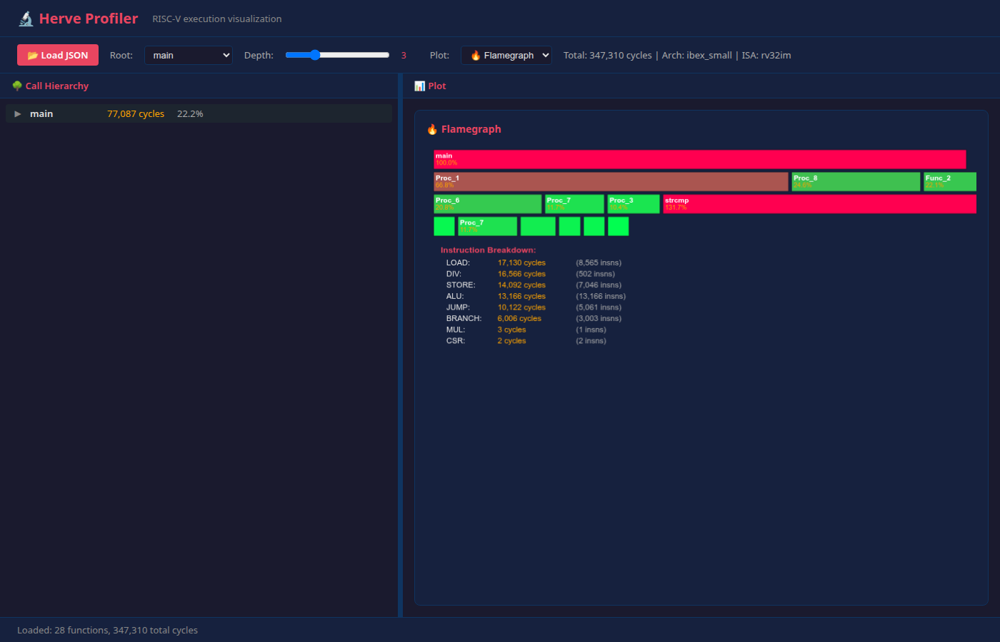

# Herve

Herve is a lightweight **RV32IM[C] Instruction Set Simulator (ISS)** written in C. It is designed for fast functional simulation of RISC-V programs, with direct integration into Verilog/SystemVerilog testbenches via **Verilator DPI-C**, **Icarus Verilog VPI**, and **ModelSim DPI-C**.

The name "Herve" is a French person's name that happens to have similar pronunciation to "RV", the shorthand for RISC-V.

## Features

- **RV32IM[C] ISA support** — Base integer (I), multiply/divide (M), and compressed (C) extensions
- **Verilator DPI-C integration** — Embed the ISS directly into RTL simulations
- **Icarus Verilog VPI integration** — VPI system functions for Icarus-based simulations
- **ModelSim DPI-C integration** — DPI-C shared library for ModelSim (Intel FPGA Edition) simulations
- **Standalone mode** — Run RISC-V programs without any HDL simulator or RISC-V toolchain
- **Advanced Profiling** — Built-in instruction and function-level profiling with cycle-accurate architecture models
- **AHB-Lite GPIO testcase** — Full example of bus-level peripheral integration
- **Interrupt support** — External interrupt handling via DPI-C
- **Benchmarked** — 9,879× faster than Spike on riscv-tests ISA suite (51/51 tests passing)

## Quick Start

### Standalone ISS Test (no toolchain required)

The fastest way to try Herve — just needs `g++`:

```bash
cd dpi-riscv
make run_standalone
```

This compiles and runs a built-in test program directly on the ISS without any RISC-V toolchain or HDL simulator.

### Standalone ELF Runner & Profiler

Herve includes a standalone CLI (`herve`) that can run RISC-V ELF files and generate detailed profiling reports:

```bash
cd dpi-riscv
make herve
./herve run firmware.elf --arch=ibex_small --profile --out=profile.csv
```

**Profiling Capabilities:**
- **Architecture Models**: Select from pre-configured models like `serv`, `picorv32`, `ibex_small`, `vexriscv`, `cva6`, `boom`, or `xiangshan`.
- **Function-level Stats**: Automatically tracks calls and cycles per function using ELF symbol table data.
- **Instruction Breakdown**: Categorizes execution into ALU, Load, Store, Branch, Mul, Div, etc.
- **Call-graph Tracking**: Records caller→callee edges with call counts.
- **CSV Output**: Generates machine-readable reports for performance analysis.
- **Zero Overhead**: Uses optimized execution paths when profiling is disabled to maintain high simulation speeds.

#### End-to-end profiling example

This walkthrough profiles the **Dhrystone** benchmark bundled in the repo,
converts the CSV to JSON, and opens the visualizer.

**1. Build the Dhrystone benchmark**

```bash
cd dpi-riscv
make dhrystone.riscv
```

This produces ``dhrystone.riscv``, a statically-linked RISC-V ELF containing
Dhrystone 2.1 with 30+ functions (``main``, ``Proc_1`` … ``Proc_8``,
``Func_1`` … ``Func_3``, ``strcmp``, ``printf``, etc.).

**2. Profile with Herve**

```bash
make herve
./herve run dhrystone.riscv --arch=ibex_small --profile --out=profile.csv
```

Excerpt of ``profile.csv``::

    META,arch,ibex_small
    META,isa,rv32im
    META,total_cycles,347310
    META,total_instructions,198706
    FUNC,Print_Stats,total_cycles,15229
    FUNC,Print_Stats,calls,1
    INSTR,Print_Stats,ALU,4753
    ICOUNT,Print_Stats,ALU,4753
    INSTR,Print_Stats,LOAD,5394
    ICOUNT,Print_Stats,LOAD,2697
    ...
    FUNC,main,total_cycles,77087
    FUNC,main,calls,1
    FUNC,Proc_1,total_cycles,51500
    FUNC,Proc_1,calls,500
    FUNC,Func_2,total_cycles,17000
    FUNC,Func_2,calls,500
    FUNC,strcmp,total_cycles,101500
    FUNC,strcmp,calls,500
    ...
    CALL,main,printf,2
    CALL,printf,vprintfmt,2
    CALL,vprintfmt,putchar,97
    CALL,main,Proc_1,500
    CALL,Proc_1,Proc_2,500
    CALL,Proc_1,Proc_3,500
    CALL,Proc_1,Proc_7,500
    CALL,Proc_6,Func_3,500
    ...

The CSV contains 30+ functions with per-instruction-type cycle counts and
caller→callee edges — a realistic multi-function profile ready for analysis.

**3. Convert CSV to hierarchical JSON**

```bash
python3 scripts/profiler_csv_to_json.py profile.csv -o profile.json
cat profile.json
```

See the [JSON output structure](llm/profiler.md#json-output-structure) in the
design document for the full schema.

**4. Visualize**

Open the visualizer and load the JSON file:

```bash
xdg-open scripts/profiler_visualizer.html   # Linux
open scripts/profiler_visualizer.html       # macOS
```

Click **Load JSON** and select ``profile.json``. The visualizer opens with a
flamegraph by default. Use the plot dropdown to switch between **Icicle**
(zoomable partition layout with breadcrumb navigation), **Sunburst**
(hierarchical ring chart), **Flamegraph**, and **Treemap** (squarified
layout). The call hierarchy tree is always visible in the left pane with a
draggable resize divider. Use the **Root** dropdown to pick any function as
the hierarchy root (defaults to ``main``) and the **Depth** slider to limit
nesting.



**Notes**

- Any RISC-V ELF compiled with ``-march=rv32im`` (or ``rv32imc``) that
  has debug symbols works — function names are resolved from the ELF symbol
  table.
- For long-running programs, pass ``--max-cycles=<N>`` to limit simulation
  time, for example ``--max-cycles=500000``.

### Verilator DPI Test

```bash
cd dpi-riscv
make firmware    # Build firmware binary (requires RISC-V toolchain)
make run         # Run Verilator simulation with DPI-C integration
```

## Installation / Prerequisites

### RISC-V Toolchain

Required for building firmware binaries:

```bash
sudo apt update
sudo apt install gcc-riscv64-unknown-elf binutils-riscv64-linux-gnu
```

### Verilator (for DPI-C simulation)

```bash
sudo apt install verilator
```

### Icarus Verilog (for VPI simulation)

```bash
sudo apt install iverilog
```

### ModelSim (optional, for ModelSim DPI-C simulation)

ModelSim Intel FPGA Starter Edition is a free 32-bit application. On 64-bit systems, install 32-bit compatibility libraries:

```bash
sudo bash dpi-riscv/tests/install_modelsim_deps.sh
```

See [ModelSim Documentation](dpi-riscv/docs/modelsim.md) for detailed setup and usage instructions.

### Spike (optional, for benchmarking)

The official RISC-V ISA simulator, used as a reference for performance comparison:

```bash
bash install_spike.sh
```

This installs Spike to `/opt/riscv` and adds it to your `PATH`.

## Verilog-DPI Integration

Herve can be embedded into RTL testbenches via DPI-C (Verilator), VPI (Icarus), or DPI-C (ModelSim).

### Verilator DPI-C

The RTL top level exports MMIO read/write functions and imports ISS control functions:

```systemverilog
// Exported to C (ISS)
export "DPI-C" function int dpi_mmio_read(int addr);
export "DPI-C" function void dpi_mmio_write(int addr, int data);

// Imported from C (ISS)
import "DPI-C" function void rv_init(string fw, int ram_sz);
import "DPI-C" function int  rv_step(int max_insn);
```

### Icarus Verilog VPI

Icarus does not support DPI-C import/export. Instead, use VPI system functions via a shared library (`sim/vpi/rv32_dpi_vpi.c`):

| VPI Call | Type | Description |
|----------|------|-------------|
| `$rv_init(fw, ram_sz)` | task | Load firmware binary into ISS |
| `$rv_reset(pc)` | task | Reset ISS to given Program Counter |
| `$rv_step(max_insn)` | function → int | Execute up to max_insn instructions |
| `$rv_get_reg(reg)` | function → int | Read x[reg] value |
| `$rv_get_pc()` | function → int | Read current Program Counter |
| `$vpi_read_mmio(idx)` | function → int | Read MMIO register at index idx |
| `$vpi_print_mmio()` | task | Print MMIO register state to simulator log |

Run the Icarus VPI smoke test:

```bash
cd dpi-riscv
make firmware
make run_icarus
```

### ModelSim DPI-C

ModelSim supports DPI-C import/export natively. A dedicated DPI-C bridge library (`sim/modelsim/rv32_dpi_mti.c`) provides wrapper functions for ISS integration:

| DPI-C Call | Type | Description |
|------------|------|-------------|
| `rv_init(fw, ram_sz)` | import | Load firmware binary into ISS |
| `rv_reset(pc)` | import | Reset ISS to given Program Counter |
| `rv_step(max_insn)` | import | Execute up to max_insn instructions |
| `rv_get_pc()` | import | Read current Program Counter |
| `rv_mti_write_ram(offset, value)` | import | Write a 32-bit word to ISS RAM |
| `rv_mti_set_irq(mask)` | import | Set interrupt bitmask |
| `dpi_mmio_read(addr)` | export | Read MMIO register (callable from C) |
| `dpi_mmio_write(addr, data)` | export | Write MMIO register (callable from C) |

Compile the shared library and run a test:

```bash
cd dpi-riscv

# Build firmware
make firmware firmware_muldiv firmware_irq firmware_ahb firmware_mmio_regs

# Compile the 32-bit DPI-C shared library
gcc -shared -fPIC -m32 -I./sim/iss -o sim/modelsim/rv32_dpi_mti.so \
    sim/modelsim/rv32_dpi_mti.c sim/iss/rv32_dpi.c

# Run all ModelSim tests
bash tests/run_modelsim.sh
```

Five pre-built testbenches are available in `sim/modelsim/`:

| Testbench | Description |
|-----------|-------------|
| `tb_modelsim_basic.sv` | Basic MMIO smoke test |
| `tb_modelsim_mmio_regs.sv` | MMIO register config test |
| `tb_modelsim_muldiv.sv` | MUL/DIV extension test |
| `tb_modelsim_irq.sv` | IRQ + WFI test |
| `tb_modelsim_ahb.sv` | AHB GPIO self-test |

For detailed documentation, see [ModelSim Documentation](dpi-riscv/docs/modelsim.md).

### MMIO Address Map

The ISS recognizes MMIO accesses in the range `0x1000_0000` – `0x100F_FFFF`. Any load or store to this region triggers a DPI-C/VPI call to the RTL.

| Address | Register | Width | Access | Description |
|---------|----------|-------|--------|-------------|
| `0x1000_0000` | `GPIO_OUT` | 32 | R/W | Output value (bit 0 = LED / ext_irq) |
| `0x1000_0004` | `GPIO_IE` | 32 | R/W | Interrupt enable |
| `0x1000_0008` | `GPIO_STATUS` | 32 | R | Interrupt status (bit 0 = IRQ pending) |

### AHB-Lite GPIO Testcase

A complete example integrating Herve with an AHB-Lite bus and GPIO peripheral is available:

```bash
cd dpi-riscv
make firmware_ahb
make run_ahb
```

## Benchmark Results: Herve ISS vs Spike

Herve was benchmarked against **Spike** (the official RISC-V ISA simulator) using the standard **riscv-tests** ISA test suite (51 tests: RV32I + RV32M + RV32C).

### Summary

| Metric | Herve ISS | Spike | Speedup |
|--------|-----------|-------|---------|
| **Total instructions** | 18,157 | 273,022 | — |
| **Total time** | 0.000454 s | 4.485 s | **9,879×** |
| **Overall IPS** | 39,993,392 | 60,874 | **657×** |
| **Tests passed** | **51/51** | 51/51 | — |
| **Geometric mean speedup** | — | — | **16,929×** |
| **Min speedup** | — | — | 463× |
| **Max speedup** | — | — | 132,000× |

### Why is Herve So Much Faster?

Herve is a **lightweight, single-file ISS** with minimal overhead. It does not model:
- Pipeline stages or cache hierarchy
- Memory management (MMU/PMU)
- Multiple harts/cores
- Physical memory protection (PMP)
- Trap handling and CSRs (beyond basic execution)
- Device tree or platform devices

Spike is a **full-featured, golden-reference simulator** that models a complete RISC-V platform including all of the above. For each test, Spike goes through a full boot sequence, sets up privilege levels, handles traps, and manages CSRs — contributing to the ~15× higher instruction count and significantly longer wall-clock time.

### How to Reproduce

```bash
cd dpi-riscv

# 1. Build riscv-tests
bash tests/run_riscv_tests.sh

# 2. Run Herve benchmark
make run_benchmark

# 3. Run Spike benchmark
make run_spike_benchmark

# 4. Compare results
make compare_benchmark
```

Raw data: `dpi-riscv/herve_benchmark.csv` and `dpi-riscv/spike_benchmark.csv`

For a detailed breakdown including per-test results, HTIF benchmarks (median, mm, memcpy), methodology, and analysis, see [Benchmark Results](dpi-riscv/docs/benchmark_results.md).

## Project Structure

```
herve/
├── LICENSE                     # Apache 2.0
├── README.md
├── install_spike.sh            # Spike installation script
├── install_toolchain.sh        # RISC-V toolchain installation
├── dpi-riscv/
│   ├── Makefile                # Build targets for all testcases
│   ├── firmware.S              # Firmware assembly (basic test)
│   ├── firmware_ahb.S          # Firmware for AHB-Lite GPIO test
│   ├── firmware_irq.S          # Firmware for IRQ test
│   ├── firmware_muldiv.S       # Firmware for MUL/DIV test
│   ├── herve_benchmark.csv     # Herve benchmark raw data
│   ├── spike_benchmark.csv     # Spike benchmark raw data
│   ├── docs/
│   │   ├── arch.md             # Architecture documentation
│   │   ├── benchmark_results.md # Detailed benchmark analysis
│   │   ├── integration.md      # DPI/VPI integration guide
│   │   ├── isa_support.md      # ISA support details
│   │   └── modelsim.md         # ModelSim DPI-C integration guide
│   ├── sim/
│   │   ├── iss/                # ISS core (rv32_dpi.c, test harnesses)
│   │   ├── harness/            # Verilator testbench harnesses
│   │   ├── vpi/                # Icarus VPI wrapper
│   │   ├── icarus/             # Icarus testbenches
│   │   ├── modelsim/           # ModelSim DPI-C bridge and testbenches
│   │   ├── bus/                # AHB-Lite BFM
│   │   └── dut/                # AHB GPIO DUT
│   └── tests/                  # Test scripts and analysis tools
└── riscv-tests/                # riscv-tests submodule (ISA tests)
```

## Development Environment

The `llm/` directory contains utility scripts for setting up AI-assisted development workflows.

### `llm/agent.sh` — Developer Agent Session

Launches a **tmux** workspace pre-configured for agentic coding:

| Pane | Tool | Purpose |
|------|------|---------|
| Left | `ranger` | Terminal file browser for quick navigation |
| Right top | `bash` | General-purpose shell |
| Right bottom | `cline --tui` | Cline AI agent in TUI (terminal UI) mode |

**Usage:**

```bash
cd llm
bash agent.sh
```

**Requirements:** `tmux`, `ranger`, and `cline` installed and available in `PATH`.

**Layout:** Three panes in a left–right split (left pane for ranger, right column split top–bottom for bash/cline). The shell pane is focused by default.

### Other Scripts in `llm/`

| Script / Directory | Purpose |
|--------------------|---------|
| `install_gemini_cli.sh` | Sets up a Node.js project with Google's Generative AI SDK |
| `install_ollama_deepseek.sh` | Installs Ollama and pulls the DeepSeek Coder model |
| `install_openclaw.sh` | Clones and installs the OpenClaw project in `~/openclaw` |
| `install_pi_whatsapp_connector.sh` | Installs the WhatsApp connector for pi (see below) |
| `pi-whatsapp-connector/` | WhatsApp ↔ pi-coding-agent bridge |

### `llm/pi-whatsapp-connector/` — WhatsApp ↔ pi Bridge

A [pi-coding-agent](https://pi.dev) connector that lets you chat with pi through **WhatsApp**.
Send a message to your WhatsApp number and pi responds with AI-powered coding assistance.

**How it works:**

```
WhatsApp ──► pi-whatsapp-connector ──► pi-coding-agent SDK ──► LLM
               │                                               │
               ◄────────────────── response ◄──────────────────┘
```

**Quick start:**

```bash
cd llm/pi-whatsapp-connector
npm install
node index.mjs
# Scan the QR code with WhatsApp → Linked Devices → Link a Device
```

**Requirements:** Node.js >= 18, a WhatsApp account.

Built with [baileys](https://github.com/WhiskeySockets/Baileys) (WhatsApp Web library) and the [pi SDK](https://pi.dev).
Inspired by the [OpenClaw WhatsApp channel](https://github.com/openclaw/openclaw/tree/main/extensions/whatsapp).

See [pi-whatsapp-connector/README.md](llm/pi-whatsapp-connector/README.md) for full documentation.

## License

Apache 2.0 — see [LICENSE](LICENSE) for details.
